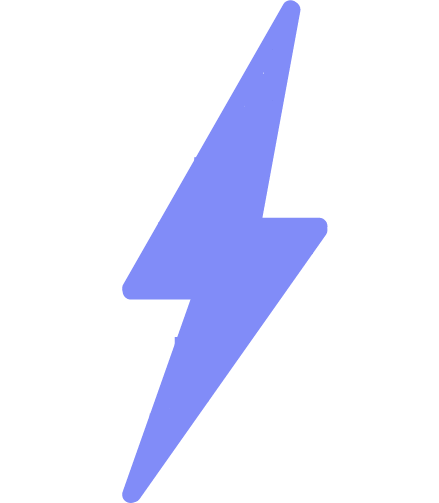
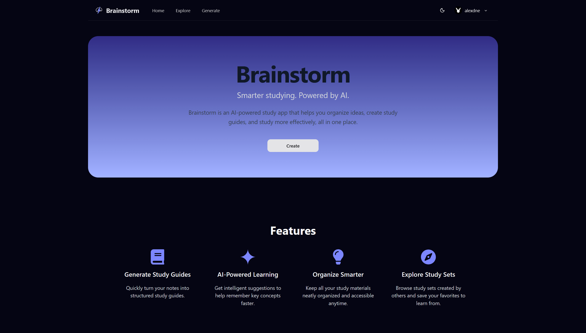
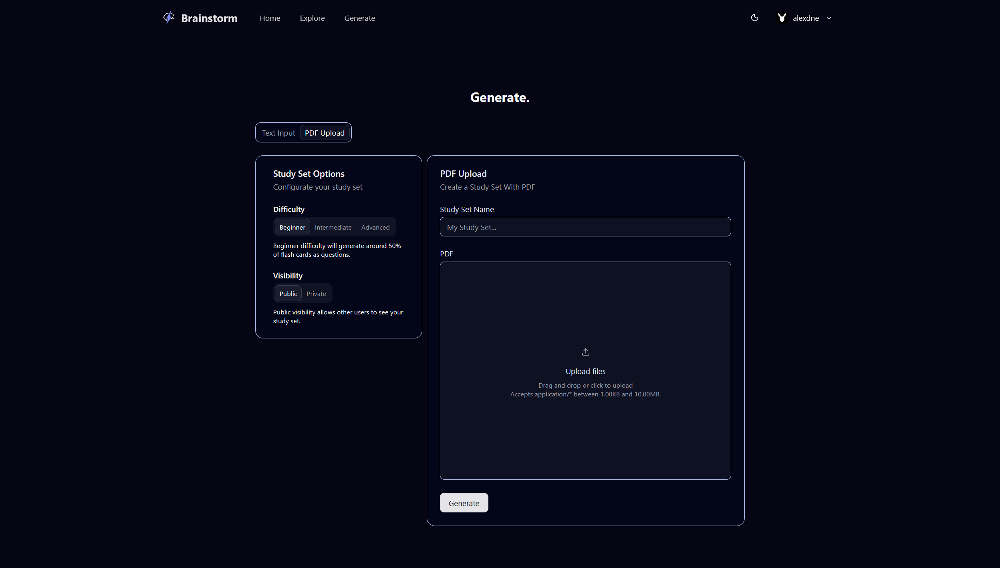
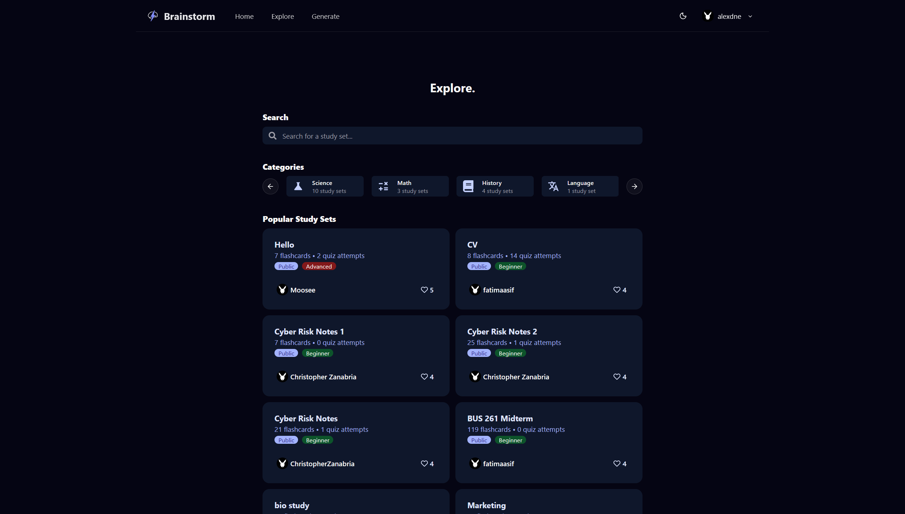
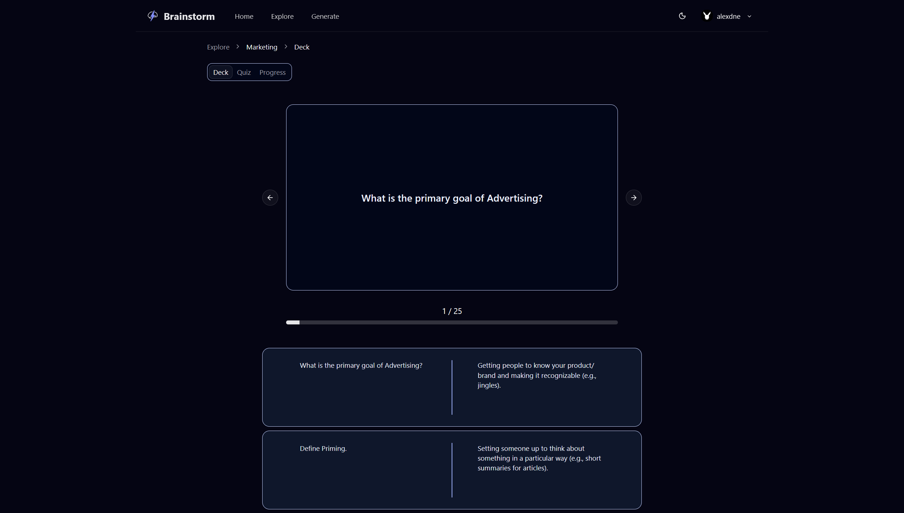
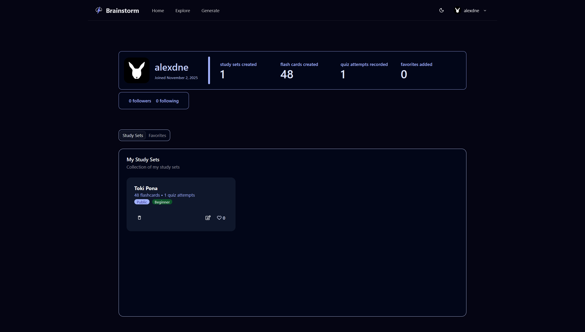
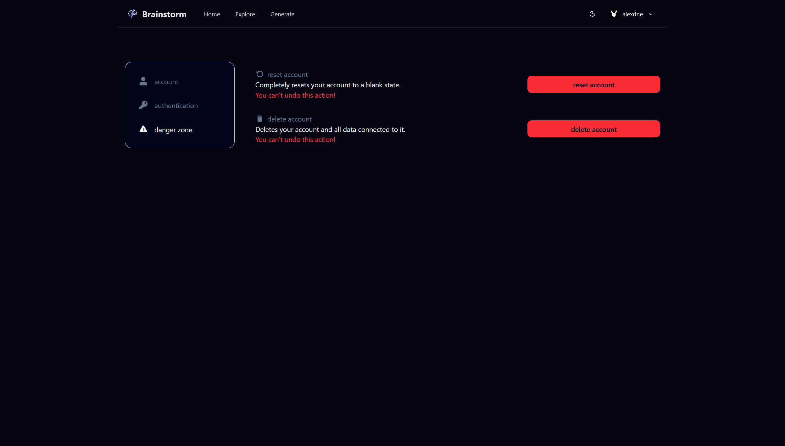

# Brainstorm

  
  <h1>Brainstorm</h1>

  

Table of Contents

<ol>
  <li>
    <a href="#introduction">Introduction</a>
  </li>
  <li>
    <a href="#features">Features</a>
    <ul>
      <li>
        <a href="#built-with">Built With</a>
      </li>
    </ul>
  </li>
  <li><a href="#preview">Preview</a></li>
  <li><a href="#contributing">Contributing</a></li>
  <li><a href="#license">License</a></li>
</ol>

## Introduction
Brainstorm is an intelligent study web application that transforms user-provided text or PDFs into structured study materials - including flashcards and quizzes.

## Features
- ✏️ Study Set Generation
    - Paste text or upload a PDF to automatically generate flashcards and quizzes.
    - Generated study sets are stored and updated in the database.
- 🌍 Explore Page
    - Browse popular study sets created by other users.
    - Use search and category filters to find specific topics.
    - Favorite study sets to save them for later and boost their popularity.
    - View other user profiles to explore their shared sets and learning topics.
- 📚 Flashcards & Quizzes
    - Flashcards summarize key terms and definitions extracted from user input.
    - Quizzes test comprehension with randomized multiple-choice questions.
    - Both formats can be saved, reviewed, and reshuffled for repeated practice.
- 👤 User System
    - User authentication and profiles.
    - Each user can create, favorite, and manage their own study sets.

### Built With

[![React][React]][React-url]
[![React-router][React-router]][React-router-url]
[![React-hook-form][React-hook-form]][React-hook-form-url]
[![Vite][Vite]][Vite-url]
[![Shadcn][Shadcn]][Shadcn-url]
[![Tailwind][Tailwind]][Tailwind-url]
[![Node][Node]][Node-url]
[![Express][Express]][Express-url]
[![PostgreSQL][PostgreSQL]][PostgreSQL-url]
[![Prisma][Prisma]][Prisma-url]
[![Gemini][Gemini]][Gemini-url]

<a href="#readme-top">Back to top</a>

## Preview

Images

### Landing Page

### Generate Page

### Explore Page

### Study Set (Cards)

### Study Set (Quiz)

### Account Page

### Settings Page

<a href="#readme-top">Back to top</a>

## Contributing

We like open-source and want to develop practical applications for real-world problems. However, individual strength is limited. So, any kinds of contribution is welcome, such as:

- New features
- Bug fixes
- Typo fixes
- Suggestions
- Maintenance
- Documents
- etc.

#### Heres how you can contribute:

1. Fork the repository
2. Create a new feature branch
3. Commit your changes
4. Push to the branch
5. Submit a pull request

<a href="#readme-top">Back to top</a>

## License

MIT License

Copyright (c) 2025 Devin

Permission is hereby granted, free of charge, to any person obtaining a copy
of this software and associated documentation files (the "Software"), to deal
in the Software without restriction, including without limitation the rights
to use, copy, modify, merge, publish, distribute, sublicense, and/or sell
copies of the Software, and to permit persons to whom the Software is
furnished to do so, subject to the following conditions:

The above copyright notice and this permission notice shall be included in all
copies or substantial portions of the Software.

THE SOFTWARE IS PROVIDED "AS IS", WITHOUT WARRANTY OF ANY KIND, EXPRESS OR
IMPLIED, INCLUDING BUT NOT LIMITED TO THE WARRANTIES OF MERCHANTABILITY,
FITNESS FOR A PARTICULAR PURPOSE AND NONINFRINGEMENT. IN NO EVENT SHALL THE
AUTHORS OR COPYRIGHT HOLDERS BE LIABLE FOR ANY CLAIM, DAMAGES OR OTHER
LIABILITY, WHETHER IN AN ACTION OF CONTRACT, TORT OR OTHERWISE, ARISING FROM,
OUT OF OR IN CONNECTION WITH THE SOFTWARE OR THE USE OR OTHER DEALINGS IN THE
SOFTWARE.

[React]: https://img.shields.io/badge/React-%2320232a.svg?style=for-the-badge&logo=react&logoColor=%2361DAFB
[React-url]: https://react.dev/

[React-router]: https://img.shields.io/badge/React_Router-CA4245?style=for-the-badge&logo=react-router&logoColor=white
[React-router-url]: https://reactrouter.com/

[React-hook-form]: https://img.shields.io/badge/React%20Hook%20Form-EC5990?style=for-the-badge&logo=reacthookform&logoColor=fff
[React-hook-form-url]: https://react-hook-form.com/

[Vite]: https://img.shields.io/badge/Vite-646CFF?style=for-the-badge&logo=vite&logoColor=fff
[Vite-url]: https://vite.dev/

[Shadcn]: https://img.shields.io/badge/shadcn%2Fui-000?style=for-the-badge&logo=shadcnui&logoColor=fff
[Shadcn-url]: https://ui.shadcn.com/

[Tailwind]: https://img.shields.io/badge/tailwindcss-%2323B2AC?style=for-the-badge&logo=tailwind-css&logoColor=white
[Tailwind-url]: https://tailwindcss.com/

[Node]: https://img.shields.io/badge/Node.js-6DA55F?style=for-the-badge&logo=node.js&logoColor=white
[Node-url]: https://nodejs.org/en

[Express]: https://img.shields.io/badge/Express.js-404d59.svg?style=for-the-badge&logo=express&logoColor=61DAFB
[Express-url]: https://expressjs.com/

[PostgreSQL]: https://img.shields.io/badge/Postgres-316192.svg?style=for-the-badge&logo=postgresql&logoColor=white
[PostgreSQL-url]: https://www.postgresql.org/

[Prisma]: https://img.shields.io/badge/Prisma-2D3748?style=for-the-badge&logo=prisma&logoColor=white
[Prisma-url]: https://www.prisma.io/docs 

[Gemini]: https://img.shields.io/badge/Google%20Gemini-886FBF?style=for-the-badge&logo=googlegemini&logoColor=fff
[Gemini-url]: https://ai.google.dev/